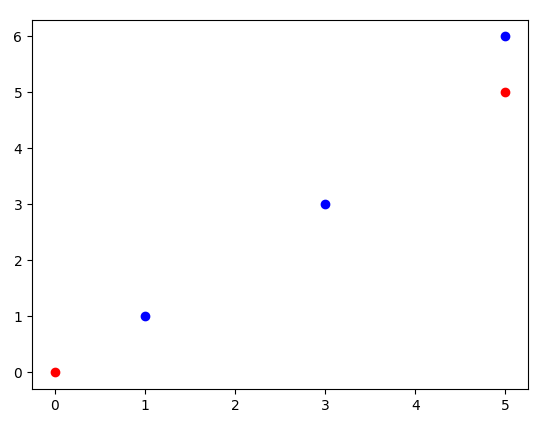
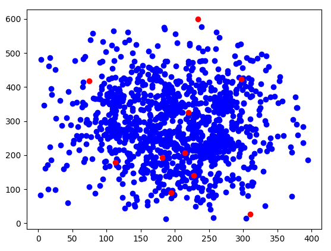
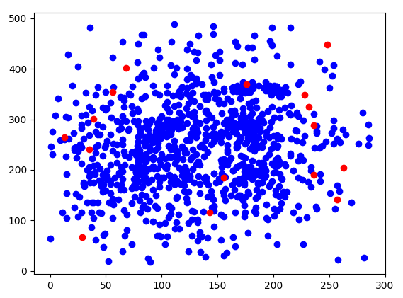
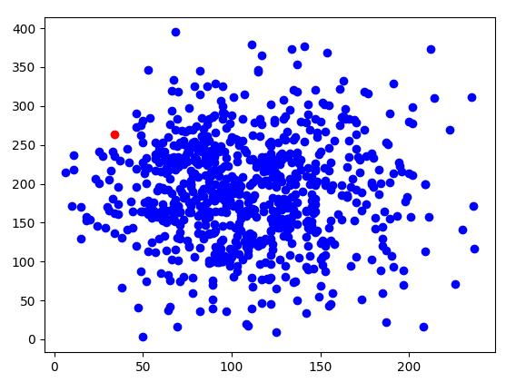

# Polyhash 2023 - Readme.md

## Projet Polyhash 2023
### Équipe BIDIA
- Lina El Arajna
- Donatien Madjibaye
- Nino Lalanne-Tisné
- Ahmed Fakhfakh

## Introduction
Le projet Polyhash 2023 vise à résoudre le problème de gestion et de coordination de drones pour la livraison efficace des commandes en ligne. Les drones autonomes, capables de voler et d'éviter le trafic, peuvent être utilisés pour livrer des produits directement aux clients. Cependant, la principale problématique réside dans la gestion et la coordination de ces drones pour optimiser la réalisation des commandes.

## Description du Projet
### Tâches/Fonctions du Projet
Nous avons défini les grandes tâches telles que le Brainstorming, la Modélisation, l'Implémentation, l'Optimisation, le Nettoyage du Code et la Documentation. Chacune de ces grandes tâches a été subdivisée en plusieurs petites tâches, que nous nous sommes réparti.

### Jeux de données :
Les points bleus representent les commandes et les points rouges représentent les entrepôts.
#### Jeu A : a_example.in

  

#### Jeu B : b_busy_day.in

  

#### Jeu C : c_redudancy.in

  

#### Jeu D : d_mother_of_all_warehouses.in

  

### Stratégies et Performances
Différents algorithmes ont été testés, parmi lesquels :

- **Naïve** : La stratégie de l'algorithme naive est relativement simple. Elle utilise une approche itérative pour traiter les commandes les unes après les autres, en essayant de les compléter une par une à l'aide des drones disponibles et des entrepôts.y

    | Fichier                       | Score  |
    |-------------------------------|--------|
    | a_example.in                  | 234    |
    | b_busy_day.in                 | 89847  |
    | c_redudancy.in                | 90978  |
    | d_mother_of_all_warehouses.in | 71442  |

- **Product by Product** : La stratégie de l'algorithme product_by_product est basée sur le traitement de chaque produit individuellement, en essayant d'optimiser la gestion des quantités disponibles dans les entrepôts et les commandes.

    | Fichier                   | Score  |
    |---------------------------|--------|
    | a_example.in              | 236    |
    | b_busy_day.in             | 71393  |
    | c_redudancy.in            | 80744  |
    | d_mother_of_all_warehouses.in | 57812  |

- **Workload Repartition** : La stratégie de l'algorithme workload_repartition est axée sur la répartition des charges de travail entre les drones pour accomplir les commandes de manière efficace.

    | Fichier d'Entrée                  | Score |
    | --------------------------------- | ----- |
    | a_example.in                      | 225   |
    | b_busy_day.in                     | 96937 |
    | c_redudancy.in                    | 96079 |
    | d_mother_of_all_warehouses.in     | 73615 |

- **Layers** : La stratégie de l'algorithme main_warehouse_layers consiste à diviser les commandes en plusieurs zones en fonction de leur proximité au centre de la grille du challenge. Chaque zone est ensuite traitée indépendamment, en évaluant la solution potentielle obtenue par la répartition de la charge de travail (workload_repartition). Les zones sont triées en fonction de leur score, calculé en considérant le nombre d'actions réalisées avec succès dans chaque zone. Enfin, les zones sont traitées séquentiellement, avec une priorité accordée aux zones ayant les scores les plus élevés.

    | Nom du Fichier                        | Score |
    | --------------------------------------|-------|
    | a_example.in                         | 222   |
    | b_busy_day.in                        | 98548 |
    | c_redudancy.in                       | 96185 |
    | d_mother_of_all_warehouses.in        | 72993 |

- **Stack Segments** : 
La stratégie de l'algorithme stack_segments consiste à traiter chaque commande individuellement en construisant un segment pour chaque commande. Pour chaque commande, les entrepôts les plus proches sont triés en ordre d'accessibilité, et un faux drone est utilisé pour simuler le processus de chargement et de livraison. Le drone parcourt les entrepôts pour charger les produits demandés jusqu'à ce que sa capacité maximale soit atteinte ou que tous les produits de la commande soient chargés. Ensuite, le drone effectue la livraison de ces produits à la destination de la commande.

    Une fois la commande complétée, les actions effectuées par le faux drone sont enregistrées en tant que nouveau segment. Ces segments sont ensuite triés en fonction de leur durée totale, et les drones les moins occupés traitent en priorité les segments les plus simples à compléter.

    | Fichier                   | Score  |
    |---------------------------|--------|
    | a_example.in              | 234    |
    | b_busy_day.in             | 100880 |
    | c_redudancy.in            | 96415  |
    | d_mother_of_all_warehouses.in | 74869  |

### Organisation du Code
Le code est organisé en classes, avec des fonctions dédiées à des tâches spécifiques. Les classes incluent des fonctionnalités telles que la gestion des drones, des entrepôts, des commandes, ainsi que des segments représentant des itinéraires de livraison.

#### Voici une brève description de chaque fichier :

##### Fichiers de Résolution (polysolver.py)
Le fichier polysolver.py contient les principales fonctions de résolution du défi Poly#. Ces fonctions utilisent divers algorithmes pour générer des solutions optimales. Voici une vue d'ensemble des principales fonctions :

- stack_segments(challenge): Cette fonction utilise une approche basée sur des segments pour optimiser la livraison des commandes.

- naive(challenge): Implémentation d'un algorithme naïf pour la livraison des commandes.

- workload_repartition(challenge): Distribue la charge de travail entre les drones de manière efficace.

- main_warehouse_layers(challenge): Organise les commandes en zones pour améliorer leur gestion.

- solve(challenge): Fonction principale qui évalue et compare les solutions générées par différentes méthodes.

##### Fichier de Parsing (polyparser.py)
Le fichier polyparser.py contient les fonctions nécessaires pour lire et interpréter les fichiers de définition de défi Poly#.

- parse_challenge(filename): Lit un fichier de défi Poly# et extrait les informations nécessaires.
##### Fichier Principal (polyhash.py)
Le fichier polyhash.py est le point d'entrée principal du programme. Il utilise les fonctions de résolution et de parsing pour générer une solution au défi Poly#.

##### Autres Classes
Le projet comprend également plusieurs autres classes essentielles, notamment Drone.py, Order.py, Segment.py, Warehouse.py, et Challenge.py. Ces classes définissent les entités clés du problème et sont utilisées dans le processus de résolution.

## Procédure d'Installation
1. Clonez le repository depuis : https://gitlab.univ-nantes.fr/E23B933N/polyhash2023.git

1. Assurez-vous d'avoir les dépendances nécessaires installées. Vous pouvez les installer en exécutant la commande suivante dans le répertoire du projet :

        pip install -r requirements.txt

    Cela garantira que toutes les bibliothèques requises sont installées sur votre système.

## Procédure d'Exécution
1. Chargez le fichier de données de simulation.
2. Pour exécuter le programme et générer une solution, utilisez la commande suivante dans le terminal : 

        python polyhash.py challenge.in sortie

    Assurez-vous de remplacer challenge.in par le chemin du fichier de défi que vous souhaitez résoudre, et sortie par le nom du fichier dans lequel vous souhaitez enregistrer la solution.

**L'algorithme qui s'execute est celui de stack_segments, si vous voulez utilisez d'autres algorithmes il suffit de les décommenter**

## Bugs et Limitations Connus
- Des erreurs de calcul peuvent survenir dans la fonction de scoring, entraînant des divergences avec les résultats du simulateur.

## Autres Informations

- En raison du manque de temps, la visualisation des données n'a pas été priorisée, mais pourrait être envisagée comme une amélioration future.

